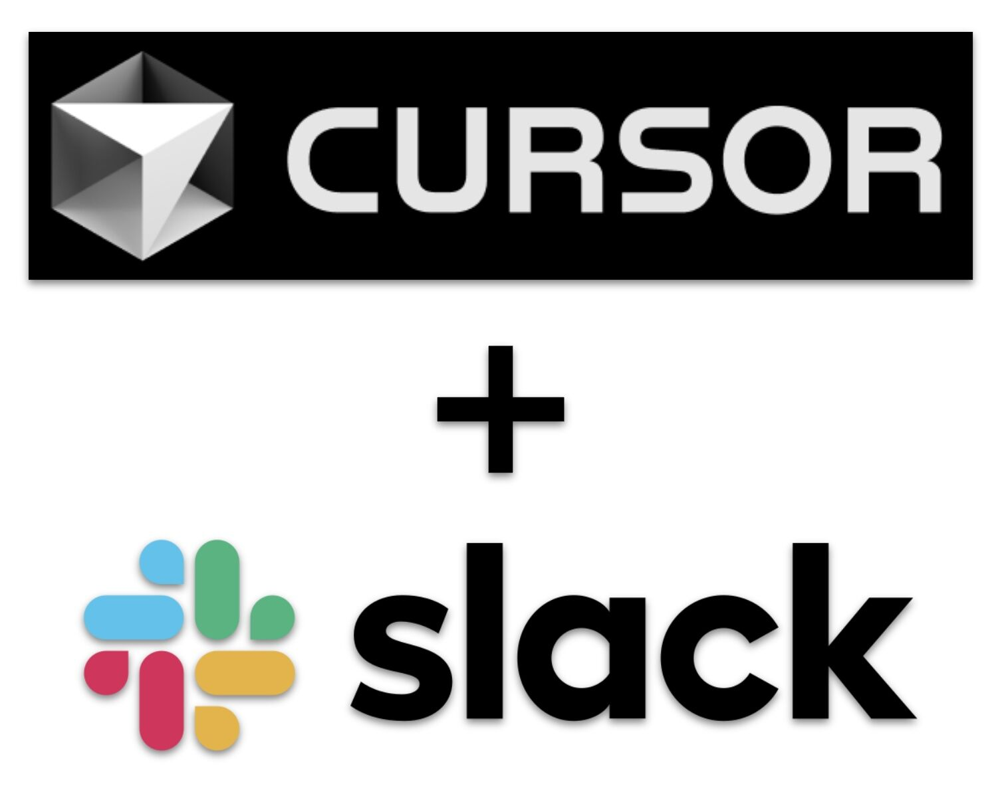

<p align="center">
  
</p>

<h1 align="center">Slacksor</h1>

<p align="center">
  A local Python bridge between Slack and the <code>cursor agent</code> CLI.<br/>
  Send a message in Slack, get a full Cursor Agent response back in the same thread.
</p>

---

## How It Works

Slacksor maps local workspace paths to Slack channels. When a message arrives in a mapped channel, it spawns a headless `cursor agent` subprocess, streams the output, and posts the result back into the Slack thread.

- **Slack Socket Mode** -- no public URL or webhook needed
- **Thread-based sessions** -- top-level message starts a new chat, replies resume it via `--resume <chat_id>`
- **One agent per workspace** -- concurrent messages are queued; `stop` / `exit` terminates the running process
- **Bot presence** -- bot shows online/offline based on whether the bridge is running
- **SQLite persistence** -- sessions survive restarts; orphaned processes are recovered on launch

## Features

- Spawn `cursor agent` headlessly with `--print --output-format stream-json`
- Chunked Slack output with Markdown formatting
- Completion reaction on thread root
- Auto-install Cursor user hooks (`beforeSubmitPrompt`, `afterAgentResponse`) for IDE sync
- Mirror IDE chat transcripts into Slack threads
- Cursor command integration (`/review`, `/tests`, etc.) via `.cursor/commands/`
- Shell command passthrough (`!git log`, `!ls`, etc.)
- TUI dashboard (Textual) or headless `serve` mode
- Slack thread/message referencing -- paste a Slack URL to include that conversation as context
- Per-project model overrides

## Bridge Commands

Commands intercepted by the bridge (not forwarded to the AI):

**General**

| Command | Description |
|---|---|
| `help` | Show available commands |
| `ping` | Check bridge status, uptime, queue depth |
| `model` | Show current model and available options |
| `model <name>` | Set default model for new requests |
| `stop` / `exit` | Terminate the active agent session |
| `!<cmd>` | Run a shell command in the workspace (e.g. `!npm test`) |
| `/<cmd>` | Use a Cursor command file (`.cursor/commands/<cmd>.md`) |

**Git**

| Command | Description |
|---|---|
| `status` | Show `git status` for the workspace |
| `branch` | Show git branches with current branch highlighted |
| `checkout <name>` | Switch to a branch; creates it if it doesn't exist |
| `diff` | Show git diff summary (changed lines per file) |
| `log` | Last 15 commits in oneline format |
| `last` | Last commit with file-level stats |
| `stash` | Show the last 15 stash entries |
| `stash <n>` | Apply `stash@{n}` to the working tree |
| `pull` | Pull current branch from origin |
| `blame <file>` | Show `git blame` for a file |
| `conflicts` | List files with merge conflicts |
| `whoami` | Show git user.name and user.email |

**Workspace**

| Command | Description |
|---|---|
| `ls` | List files in the workspace (`ls -la`) |
| `dir` | Show the workspace directory path |

## Getting Started

Run `./start.sh` to get going. It prompts for any missing environment variables (Slack tokens, preferences) and lets you choose between TUI and headless mode. Alternatively, copy `.env.example` to `.env` and fill it out manually. All Python source lives under `src/`.

For full setup instructions (Slack app creation, required scopes, Socket Mode, all configuration options, launchd auto-start), see **[INSTRUCTIONS.md](INSTRUCTIONS.md)**.

## Architecture

```
Slack Channel  <--Socket Mode-->  Slacksor  <--subprocess-->  cursor agent CLI
                                     |
                                  SQLite DB
                                (projects, sessions,
                                 transcripts, hooks)
```

**Data model:**
- `projects` -- workspace path to Slack channel mapping
- `sessions` -- thread to `cursor_chat_id` mapping, status, pid
- `transcript_sync` -- IDE transcript file checkpoints
- `hook_conversations` -- Cursor `conversation_id` to Slack thread mapping

**Key modules** (all under `src/`):
- `slacksor.py` -- entrypoint, CLI parser, runtime lifecycle
- `slack_handlers.py` -- Slack event routing and bridge commands
- `session_manager.py` -- agent process lifecycle per workspace
- `cursor_agent.py` -- `cursor agent` subprocess wrapper and stream-json parser
- `db.py` -- SQLite schema and queries
- `transcript_watcher.py` -- IDE transcript mirroring
- `tui/` -- Textual dashboard

## Cursor Hooks Sync

On startup, Slacksor installs user-level hook files if they are missing:

- `~/.cursor/hooks.json`
- `~/.cursor/hooks/slacksor_sync.py`

The hook script captures `beforeSubmitPrompt` and `afterAgentResponse` events, writing them to `~/.cursor/slacksor-hook-events.jsonl`. Slacksor consumes these events to mirror IDE conversations into Slack threads, so replies in Slack can resume the same IDE chat.

Disable with `SLACKSOR_ENABLE_CURSOR_HOOKS_SYNC=false`.

## Requirements

- Python 3.11+
- `cursor` CLI installed and authenticated
- A Slack workspace where you can create apps

## License

MIT

## Disclaimer

This project is a proof of concept, built primarily with the assistance of Cursor AI. It is provided as-is with no guarantees of reliability or fitness for production use. You are welcome to fork, modify, and redistribute this work, provided you include attribution to the original project.
